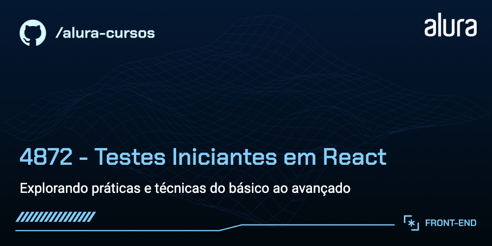
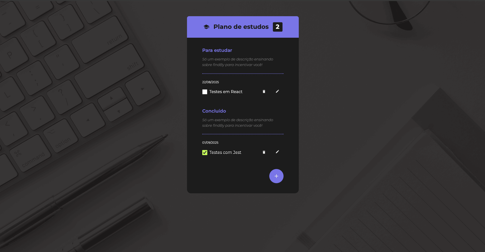

# Testando um App de Checklist de Estudos

Um projeto para quem já conhece as tecnologias mais importantes da web (HTML, CSS, JS) e o básico de ReactJS, mas deseja alcançar um novo nível de qualidade em suas aplicações, tornando-as confiáveis, robustas e manuteníveis mesmo com o passar do tempo. Ao longo do curso, criamos testes unitários, de componentes e E2E para uma aplicação React já desenvolvida e entendemos, na prática e com embasamento teórico, como os testes melhoram a qualidade de vida de todo o time.

## 🔨 Funcionalidades do projeto

- Criação de testes unitários
- Construção de testes de integração/componente
- Desenvolvimento de testes E2E (End-to-End)
- Utilização de Mocks, Stubs e Spies
- Visualização e análise de relatórios de coverage (cobertura de código)
- Adição de NPM scripts e snippets para produtividade



## ✔️ Técnicas e tecnologias utilizadas

Os conhecimentos desenvolvidos ao longo do projeto abordam as seguintes técnicas e tecnologias:

- **Pirâmide de Testes:** Metodologia que organiza e prioriza diferentes tipos de testes.
- **Jest:** Framework de testes JavaScript para testes unitários e de integração.
- **React Testing Library:** Ferramenta para testar componentes React focando no usuário.
- **Cypress:** Ferramenta para escrever e executar testes E2E no navegador.
- **Mocks, Stubs e Spies:** Simulam dependências para isolar o código em testes.
- **Code Coverage:** Mede a porcentagem de código coberto por testes.
- **Falso-Positivos:** Entendimento e prevenção de testes enganosos.
- **npm scripts, entensões, snippets e muito mais:** Dicas práticas que vão ajudar você a ser um dev melhor e mais produtivo.

## 🛠️ Como rodar o projeto

Após baixar o projeto, siga os passos abaixo para executar localmente:

1. Certifique-se de que você já tem Node.js instalado ([guia oficial](https://nodejs.org/en/download/)).
2. No terminal, navegue até a pasta do projeto e instale as dependências:

```bash
npm install
```

3. Execute o projeto:

```bash
npm start
```

4. Acesse no navegador: [http://localhost:5173](http://localhost:5173) (Vite).

## 📚 Mais informações do curso

Gostou da ideia e quer aprender com as aula? O passo a passo completo, desde a instalação até a criação de todos os testes, faz parte do curso da carreira React da Alura, com foco em experiência real de desenvolvimento, boas práticas e conceitos importantes para os devs.

Se quiser experimentar, explore o código e aumente a cobertura de testes do projeto utilizando tudo que aprendeu!

---

Aguardo você no próximo curso ou no [Manual do Front](https://www.youtube.com/@manualdofront), até a próxima 🚀
